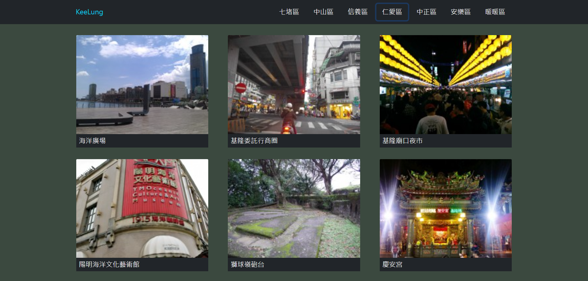

# TravelSightScraping
- I do this project while learning spring boot and web scraping
- This project is built with Java as a back-end and html CSS JavaScript as the front-end
## How I made it
- I use java with jsoup to get the sight data from a travel sight
- Then build a backend API with spring boot
- Finally uses HTML, CSS, JavaScript to build the frontend to display the  sight in Keelung.
## Demo

